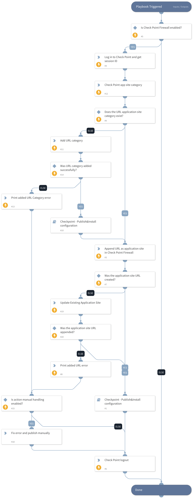

This playbook blocks URLs using Checkpoint Firewall through Custom URL Categories.
The playbook checks whether the input URL category already exists, and if the URLs are a part of this category. Otherwise, it will create the category, add the URLs, and publish the configuration.

## Dependencies
This playbook uses the following sub-playbooks, integrations, and scripts.

### Sub-playbooks
* Checkpoint - Publish&Install configuration

### Integrations
* CheckPointFirewallV2

### Scripts
* Print

### Commands
* checkpoint-application-site-add
* checkpoint-login-and-get-session-id
* checkpoint-logout
* checkpoint-application-site-category-get
* checkpoint-application-site-update
* checkpoint-application-site-category-add

## Playbook Inputs
---

| **Name** | **Description** | **Default Value** | **Required** |
| --- | --- | --- | --- |
| install_policy | Input True / False for playbook to continue install policy process for checkpoint Firewall. | True | Required |
| URL | An array of URL to block. |  | Required |
| policy_package | The name of the policy package to be installed. | Standard | Required |
| URL_application_site_category | URL category object name.  The category to add URL into. | Suspicious | Required |
| checkpoint_error_handling | In case one of the actions for publish/install policy fails due to issues on the Checkpoint side, This input will determine whether the playbook will continue or stop for manual review. Also, in case of Continue the session id will logout and all changes will discard. Values can be "Continue" or "Stop". The default value will be "Stop". | Stop | Required |
| block_URL_error_handling | In case one of the actions for block URL playbook fails due to issues on the Checkpoint side, This input will determine whether the playbook will continue or stop for manual review. Also, in case of Continue the session id will logout and all changes will discard. Values can be "Continue" or "Stop". The default value will be "Stop". | Stop | Required |
| application_site_name | Define the Application Site Name. Default: Bad_URLs. | Bad_URLs | Required |

## Playbook Outputs
---
There are no outputs for this playbook.

## Playbook Image
---
